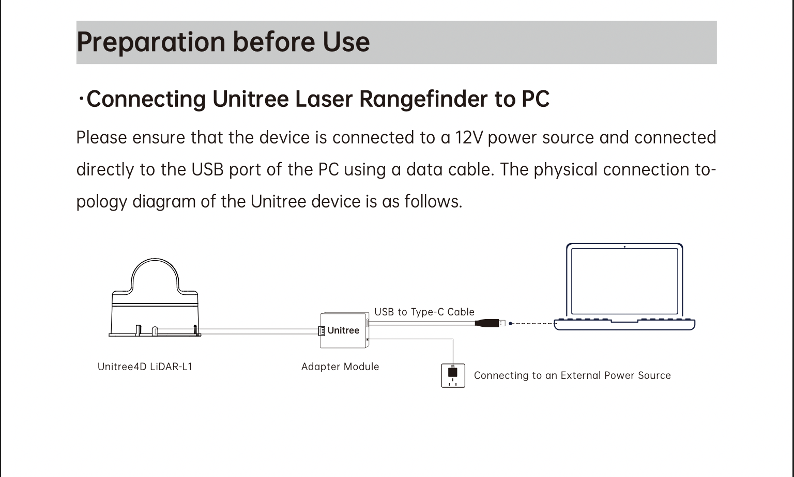

## Sensor Fusion

This repository aims to contain AI/ML algorithm implementations for a camera, LiDAR and IMU sensors.

### LiDAR

#### How to use L1

##### 1. Connect L1 to your computer



##### 2. Clone `unilidar_sdk` repository

```bash
git clone https://github.com/unitreerobotics/unilidar_sdk.git
```

##### 3. Build `unitree_lidar_ros2` package

Follow the instructions in the [README](https://github.com/unitreerobotics/unilidar_sdk/tree/main/unitree_lidar_ros2/src/unitree_lidar_ros2) file.

##### 4. Run `unitree_lidar_ros2` package

```bash
ros2 launch unitree_lidar_ros2 launch.py
```

Leave the terminal running and open a new one.

##### 5. (optional) Run `rviz2` to visualize the point cloud

```bash
rviz2 -d src/unitree_lidar_ros2/rviz/view.rviz
```

##### 6. Run the `lidar_playground` ROS2 package to listen to the point cloud and IMU data and work with them

In a new terminal, run the following commands:

Clone the `sensor-fusion` repository.

```bash
git clone https://github.com/Cyber-Fusion/sensor-fusion.git
```

```bash
cd sensor-fusion
```

Build the package.

```bash
colcon build --packages-select lidar_playground
```

Source the package.

```bash
source install/setup.bash
```

Run the package.

```bash
ros2 run lidar_playground subscriber
```

Examine the code in the [subscriber.py](./src/lidar_playground/lidar_playground/subscriber.py) file.

#### Notes

When you plug in the L1, it will start spinning its motors. To stop the motors and laser you should unplug the L1. Sometimes, you may want to stop the motors and laser without unplugging the L1. To do so, you can do the following:

1) Kill the `unitree_lidar_ros2` process in the first terminal by pressing `Ctrl+C`.
2) Add the following line to the [src/unitree_lidar_ros2/include/unitree_lidar_ros2.h](https://github.com/unitreerobotics/unilidar_sdk/blob/main/unitree_lidar_ros2/src/unitree_lidar_ros2/include/unitree_lidar_ros2.h#L115) file:

```cpp
lsdk_->setLidarWorkingMode(STANDBY);
```

and also, at the top of the same file, include the `unitree_lidar_sdk.h` header file:

```cpp
#include "unitree_lidar_sdk.h"
```

3) Build the `unitree_lidar_ros2` package again:

```bash
colcon build --packages-select unitree_lidar_ros2
```

4) Run the `unitree_lidar_ros2` package again:

```bash
ros2 launch unitree_lidar_ros2 launch.py
```

This will stop the motors and laser while the L1 is still plugged in.
To start the motors and laser again, just replace `STANDBY` with `NORMAL` and build/run again.
